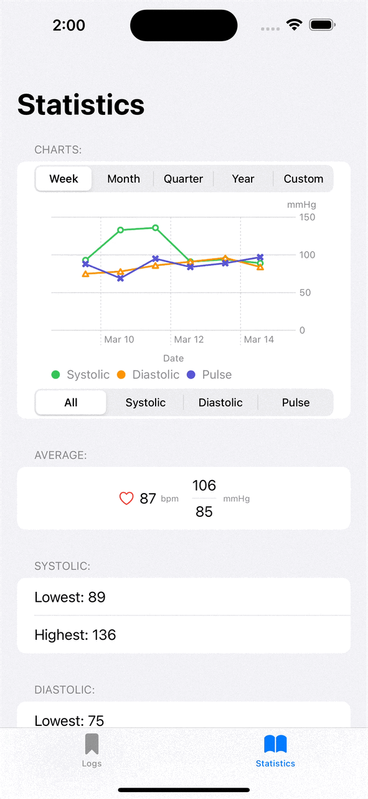

# Blood Pressure Tracker

<section align="center">
  
  &nbsp;&nbsp;&nbsp;&nbsp;&nbsp;
  
  &nbsp;&nbsp;&nbsp;&nbsp;&nbsp;

</section>

### Overview:

A customisable blood pressure app that tracks changes in readings over time.

### Use Case:

Customising the presentation of data in a way that is relevant and engaging is key to the creation of usable insights. 

This can be achieved by granting users control of filtering variables as well as providing flexibility in design and appearance. 

Empowering users with this flexibility allows them to tailor and align their interface with their unique requirements, facilitating a more personalised analysis. 

Further, being able to tag readings with custom confounders incorporates additional contextual information that enhances the depth of understanding derived from the data. 
 

    
Contents:

    <ul class="overview-section">
        <li><h3><a href="#future-plans">Future Plans</a></h3></li>
        <li><h3><a href="#current-difficulties">Current Difficulties</a></h3></li>
        <li><h3><a href="#past-problems">Past Problems</a></h3></li>
        <li><h3><a href="#screenshots">Screenshots</a></h3></li>
        <li><h3><a href="#licensing">Licensing</a></h3></li>
    </ul>

&nbsp;

# Project Progression

## Future Plans:

#### - <ins>Theme Presets</ins>

#### - <ins>Custom Chart Symbols</ins>

#### - <ins>Confounder Search & Filtering</ins>

#### - <ins>Complex Data Analysis</ins>

## Current Difficulties:

#### - <ins>Maintaining list row layout independent of dynamic variables</ins>

Using classic blood pressure reading view within a list causes variations as reading values differ. Need to rebuild view to fix size and placement within row to ensure consistency across the list.

#### - <ins>FocusState influencing .sheet pop up</ins>

Using @FocusState on a parent view to dismiss a decimal keyboard causes issues with the child .sheet pop up. When using a TextField within the sheet the view dismisses and relaunches itself. Adding a @FocusState directly to the .sheet's view seems to resolve the issue, however only temporarily, need further tests to determine which conditions cause the problem.

## Past Problems:

#### - <ins>Loading colour presets using UserDefaults</ins>

#### - <ins>Date filtering</ins>

Resolved issues associated with filtering arrays between two dates. Have done so using conditional code and UI Date Picker limitations.

#### - <ins>Simple Chart Data Type Filtering</ins>

Had difficulty displaying data points on a *LineChart* whilst still allowing for design customisation. Due to project constraints I was unable to use the *series* variable of **LineMark** and so had to find another method of delineating between datatypes whilst also allowing for simple and smooth transitions between different types of Chart. Have essentially used a switch statement however still need to modularise and condense much of this code into view components and view modifiers.

<!-- # Screenshots -->

<!-- <section align="center">
  
  &nbsp;&nbsp;&nbsp;&nbsp;&nbsp;
  
  &nbsp;&nbsp;&nbsp;&nbsp;&nbsp;

</section>
 

<section align="center">
  
  &nbsp;&nbsp;&nbsp;&nbsp;&nbsp;
  
  &nbsp;&nbsp;&nbsp;&nbsp;&nbsp;

</section>
  -->

### Licensing

There is [no license](https://choosealicense.com/no-permission/) associated with this project other than usual GitHub [Terms of Service](https://docs.github.com/en/site-policy/github-terms/github-terms-of-service), however, please be mindful and acknowledge me as the original author if you use significant or distinct portions of this code.
